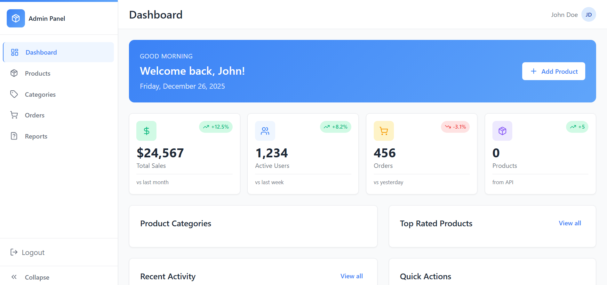
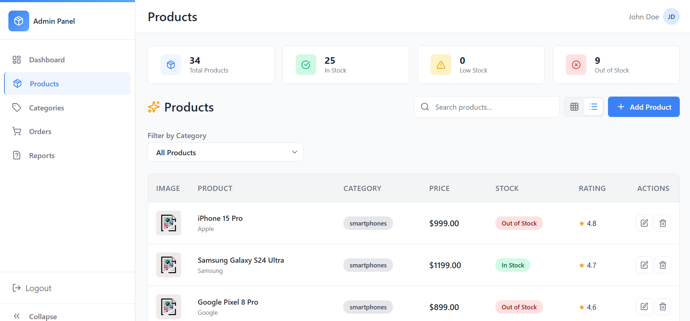
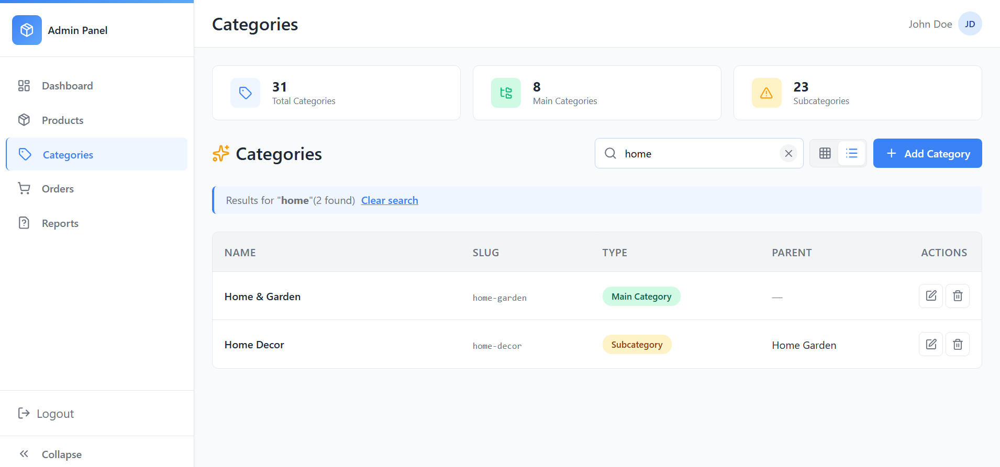
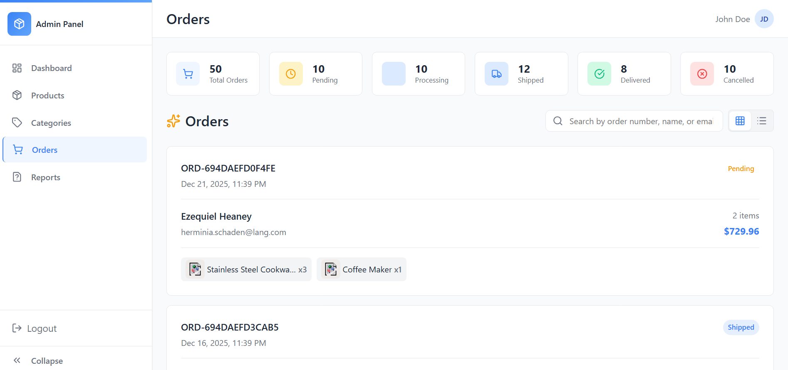

# Stock Management System

This is a full-stack stock management application I built using React for the frontend and Laravel for the backend. Everything is organized in a monorepo structure to keep things simple and maintainable.

## Table of Contents

- [Overview](#overview)
- [Features](#features)
- [Screenshots](#screenshots)
- [Tech Stack](#tech-stack)
- [Project Structure](#project-structure)
- [Getting Started](#getting-started)
- [Documentation](#documentation)

## Overview

I built this system to help administrators manage products, categories, and orders. It has a clean interface with real-time updates and secure authentication. The frontend communicates with the backend through RESTful APIs.

## Features

### Authentication

- Admin login system with secure token-based authentication
- Protected routes that require login
- Session management that keeps you logged in

### Product Management

- View all products in either grid or table view (you can switch between them)
- Add new products with all the details
- Edit existing products
- Delete products when needed
- Product detail pages showing images, descriptions, and stock info
- Filter and search products

### Category Management

- Create categories in a hierarchical structure (categories can have subcategories)
- Update category information
- Delete categories
- Filter products by category

### Order Management

- View all orders in a list
- See detailed order information including all items
- Track order status
- View order history

### Dashboard   (for now it is just placeholder of how it will became (out of scope for now))

- Overview of key statistics
- Cards showing important metrics
- Recent activity feed
- Top-rated products section

## Screenshots

Here are some screenshots of the interface:

### Main Placeholder


### Products Page


### Categories Page


### Orders Page


### Order Details


## Tech Stack

### Frontend

- React - for building the user interface
- React Router - for navigation between pages
- Vite - fast build tool and dev server
- Axios - for making API calls to the backend
- CSS Modules - for component-scoped styling
- Framer Motion - for smooth animations
- Lucide React - for icons

### Backend

- Laravel - PHP framework handling the API
- Laravel Sanctum - for API authentication
- SQLite - database (using this for development)
- Eloquent ORM - for database operations

## Project Structure

```
my-monorepo/
├── apps/
│   ├── frontend/          # React application
│   │   ├── src/
│   │   │   ├── components/    # Reusable components
│   │   │   ├── pages/         # Page components
│   │   │   ├── services/      # API services
│   │   │   ├── hooks/         # Custom hooks
│   │   │   ├── context/       # Context providers
│   │   │   └── assets/        # Static assets
│   │   └── package.json
│   │
│   └── backend/           # Laravel API
│       ├── app/
│       │   ├── Http/
│       │   │   └── Controllers/
│       │   └── Models/
│       ├── database/
│       │   ├── migrations/
│       │   └── seeders/
│       └── routes/
│           └── api.php
│
├── docs/
│   └── images/            # Screenshots and documentation images
│
└── package.json           # Monorepo root package.json
```

## Getting Started

### Prerequisites

Make sure you have these installed:
- Node.js (version 18 or higher)
- PHP (version 8.1 or higher)
- Composer
- npm or yarn

### Installation

1. Install dependencies:
```bash
npm install
cd apps/frontend
npm install
cd ../backend
composer install
```

2. Set up the backend:
```bash
cd apps/backend
cp .env.example .env
php artisan key:generate
php artisan migrate
php artisan db:seed
```

4. Configure environment variables:
- Update `apps/backend/.env` with your database configuration if needed
- Update `apps/frontend/.env` with your API URL if needed

### Running the Application

From the root directory, you can run everything together:

```bash
npm run dev

# Or run separately:
npm run dev-frontend
npm run dev-backend
```

Once running:
- Frontend will be at: http://localhost:5173
- Backend API will be at: http://localhost:8000

### Default Login Credentials

- Username: admin
- Password: password

## Documentation

See [INTEGRATION_SUMMARY.md](./INTEGRATION_SUMMARY.md) for detailed information about the architecture and how everything works.

## License

This project is private and proprietary.

## Author

Sokaina Kashbour
